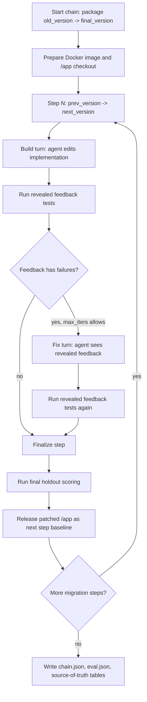

# AI Wiki Memory On SWE-Chain: Current Report

> Current public report package. Cite `source-of-truth/` first for numbers.
> Ignored local working material is outside the public artifact boundary.

## Report Goal

Artifact claim:
this is not a benchmark leaderboard report. It is a systems case study about
where repo-local agent memory helps, where it hurts, and what harness work is
needed to make those conclusions reliable.

AI Wiki premise:
AI Wiki is a repo-level self-improvement layer for coding agents. It tries to
turn repeated local development experience into bounded, reusable repo memory:
what the agent learned, which repo conventions mattered, which failures should
not be repeated, and which workflow checks should happen before or after future
implementation work.

Main question:
can repo-level agent memory improve future coding-agent work without increasing
introduced unrelated regressions?

Experimental domain:
this report uses SWE-Chain software-upgrade tasks as the first controlled
external testbed because they provide multi-step real-repo changes, isolated
execution, and target-versus-unrelated behavior scoring. The goal is not to make
"software upgrade" the whole product thesis; it is the stress test used in this
round.

## Executive Summary

This report is a current-state systems case study, not a benchmark leaderboard
or a final product claim. The audited SWE-Chain tables show that repo-local AI
Wiki memory is mechanism-sensitive: some intervention arms improve target fix
rate on specific repositories, while other arms introduce unrelated regressions
that make the net result worse than raw or `/init` baselines.

The clearest current result is negative and useful: broad or poorly placed
memory is not automatically helpful. In the Codex panel, native in-thread memory
was mixed across repositories, and the exact-match + Stop arm still regressed
badly on Flask despite its stricter retrieval rule. The strongest positive
signals are narrower: `urllib3` improved across Codex intervention arms, and
the Flask hook ablation found Stop-only strict stronger than broader hook
stacks.

The cross-model rows are directional evidence, not a model-only A/B. Codex and
Claude Code runs differed in execution location, build/fix conversation policy,
and effort settings, so this report uses them to identify mechanism behavior
and runner-parity constraints rather than to rank agents.

## Motivation

AI Wiki's first impact eval was a dogfood replay suite. I took real historical
problems from developing `ai-wiki-toolkit`, restored repository states from
before the original fixes landed, and ran fresh Codex CLI sessions with the
same original effective task prompts. The question was not whether the model
could solve those tasks after being told the answer. The question was whether
repo-local memory would let a fresh agent solve, on the first attempt, problems
that had previously required trial-and-error.

That dogfood eval was the right first test because it measured the most basic
promise of repo memory: can a future agent avoid repeating mistakes the project
has already paid for? The ambient AI Wiki workflow changed behavior on repeated
historical problems, especially around release mechanics, prompt-file
conventions, wrapper behavior, ownership boundaries, and workflow discipline.
It made the memory effect plausible.

But the pilot still answered a replay question. The target memories were written
from the same project's past failures, and the eval tasks were selected from
that known history. That is useful evidence, but it does not answer the next
product question: does memory written during earlier work help later tasks whose
shape was not known when the memory was created?

That distinction changed the evaluation target. The question was no longer
only "can memory prevent repeated trial-and-error on known historical tasks?"
The product question became: when an agent carries repo-local memory forward,
can that memory help on future work, where should it enter the next coding loop,
and when does it start to distort implementation behavior?

SWE-Chain was a useful next benchmark because it made that future-task question
concrete. It was newly available in May 2026, and it evaluates chained
release-level upgrades across real Python packages. Each step starts from the
agent's previous patched codebase, so prior decisions can help or hurt later
steps. The benchmark also provides Docker isolation and test-behavior scoring,
which lets this report separate target upgrade fixes from introduced unrelated
regressions.

This makes SWE-Chain a better stress test for AI Wiki than another dogfood-only
loop. It does not prove that software upgrades are the main product domain for
AI Wiki. Instead, software upgrades provide a controlled way to ask whether
repo-level memory improves future agent work without breaking behavior that was
not part of the current upgrade target.

Source material:

- `public/ai_wiki_impact_eval_pilot.md`
- `public/flask_swe_chain_memory_eval_report.md`
- `https://arxiv.org/abs/2605.14415`

## AI Wiki Architecture

AI Wiki is not model training, hidden state, or a vector database in this
report. The product shape tested here is a repo-local Markdown memory layer plus
a small managed prompt gate that teaches coding agents how to read and update
that memory.

This setup has changed many times through dogfood and SWE-Chain experiments.
The prompt text below is the current experimental state, not final product copy.
Much of it is deliberately explicit so benchmark runs are auditable. After a
better mechanism is selected, the prompt should be tidied into a more formal and
less benchmark-shaped product surface.

The first surface is the agent instruction file. In the SWE-Chain harness, this
means `AGENTS.md` for Codex and `CLAUDE.md` for Claude Code. The managed block
is intentionally only a gate:

```text
<!-- aiwiki-toolkit:start -->
## AI Wiki Local Workflow Gate

Before the first response, check whether `ai-wiki/_toolkit/system.md` exists.

If it exists:
- read `ai-wiki/_toolkit/system.md`
- follow its bounded read, reuse evidence, and public-only write-back workflow

If it does not exist:
- treat AI Wiki as disabled for this checkout
- do not run `aiwiki-toolkit`
- do not search or read `ai-wiki/**`
<!-- aiwiki-toolkit:end -->
```

That design keeps the installed prompt stable while letting the package-managed
workflow rules evolve in `ai-wiki/_toolkit/system.md`.

The real operating rules live in `ai-wiki/_toolkit/system.md`. In abbreviated
form, that file tells the agent:

```text
Start of task:
- do not run a router or load broad wiki areas by default
- read `ai-wiki/memory/index.md` first when it exists
- open at most one linked memory file before acting, and only on a strong match
- read other AI Wiki docs only when the task or index points to them
- treat `aiwiki-toolkit route` as optional diagnostic tooling

End of task:
- produce reuse evidence
- record reuse telemetry for user-owned docs actually consulted
- write back only durable public/local trial-error or reusable clarification
- do not write hidden evaluator information or generic task summaries as memory
```

The second surface is the repo-local wiki tree. A normal install creates a
structure like this:

```text
ai-wiki/
  index.md
  constraints.md
  conventions/
  decisions.md
  features/
  memory/index.md
  metrics/
  people/<handle>/drafts/
  problems/
  review-patterns/
  trails/
  work/
  workflows.md
  _toolkit/
.agents/skills/ai-wiki-*/
.env.aiwiki
```

The user-owned Markdown files under `ai-wiki/` are the memory source of truth.
The managed `_toolkit/` area contains system rules, schemas, generated metrics,
diagnostics, and reports. Repo-local skills under `.agents/skills/ai-wiki-*`
provide reusable workflows such as clarify-before-code, reuse evidence, and
write-back checks.

The default read mechanism uses progressive disclosure. The agent should not
load the whole wiki at task start. It first reads `ai-wiki/memory/index.md`,
treats that file as a bounded navigation index, and opens at most one linked
memory file before acting. The linked file must strongly match the current
source file, API, command, behavior, or repeated public/local failure surface.
Other AI Wiki areas such as `constraints.md`, `conventions/`, `problems/`, or
`features/` are opened only when the task, the index, or an explicit repo rule
points to them. The goal is to make memory available without turning every old
note into prompt-time pressure on the next implementation.

The earlier router layer sat between the prompt gate and the coding turn. The
toolkit could build an `aiwiki-toolkit route` packet from the task text, repo
catalog, path signals, work state, and reuse/route telemetry. That packet could
select index cards, `must_load` docs, `maybe_load` docs, and source-cited rules
for the agent to consider before coding. In early dogfood, this was a natural
extension of the product: if the repo had memory, maybe the toolkit should route
attention to the right memory. SWE-Chain made the risk easier to see. A weak
router can give special attention to plausible but low-value context, so the
current default mechanism removes router-selected special attention and leaves
routine selection to the agent under bounded index/read rules. The router remains
useful as diagnostic tooling for route quality, but not as the default
implementation mechanism.

This architecture leaves two product problems to solve:

1. Writeback problem: after a coding task, how should useful public/local
   lessons become durable repo memory? The explored candidates include
   prompt/main-thread writeback, runner-managed writeback, forked or quarantined
   writeback, package-managed hooks, lifecycle/Stop hooks, and future promotion
   into conventions or skills.
2. Safe reuse problem: before or during the next coding task, how should memory
   be exposed so that it helps implementation without causing introduced
   unrelated regressions? The explored candidates include router-selected
   context, bounded index reads, `/init` orientation, native in-thread memory,
   Stop-only/lifecycle placement, exact-match gates, and future typed memory or
   skill selection.

The experiments below should be read through those two axes. They are not just
"memory on versus memory off" comparisons. They are attempts to find a writeback
mechanism and a safe-reuse mechanism that improve future coding-agent work
without adding unrelated behavior regressions.

Source material:

- `README.md`
- `src/ai_wiki_toolkit/content.py`
- `src/ai_wiki_toolkit/scaffold.py`
- `src/ai_wiki_toolkit/route.py`
- `ai-wiki/_toolkit/system.md`

## Mechanism Variants Explored

The hook and prompt variants should be described separately from the current AI
Wiki architecture. They are mechanism explorations, not settled product
defaults.

All variants are trying to answer one or both of the same product questions:

1. What mechanism should make useful repo memory durable after a coding turn?
2. What mechanism should expose that memory to later coding turns without
   over-framing implementation or introducing unrelated behavior regressions?

The useful way to document each mechanism is:

- what prompt the agent sees before coding
- whether memory can influence the implementation turn
- what event invokes writeback
- where candidate memory is written
- what prevents hidden, future, or cross-run data from entering memory

Current mechanism map:

In this table, `What it tests` is the hypothesis, `Observed result` is the
current empirical outcome, and `Caveat` is the interpretation limit. Appendix A
contains the detailed 1-9 execution flows and source files.

| Mechanism | Prompt / memory surface | Invocation model | What it tests | Observed result | Caveat |
|---|---|---|---|---|---|
| Main-thread AI Wiki / native | `AGENTS.md` or `CLAUDE.md` contains the AI Wiki gate; the agent reads bounded `ai-wiki/memory/index.md` and performs reuse/writeback checks in the same conversation | No external hook; the implementation agent owns read and writeback discipline | Whether ordinary repo memory helps when it is available inside the coding loop | 018 Flask no-router completed 17/17 steps: build+fix F1 0.9907, introduced unrelated regression count 1, final holdout 2439/2447, 0 router command executions, and 10 main-thread memory notes. The broader 019 panel was mixed. | Can over-frame implementation and introduce unrelated behavior regressions |
| 015 runner-normal-end writeback | Prompt tells the agent to do one bounded coding pass and return normally instead of calling the writeback hook itself | The SWE-Chain runner waits for a normal Codex `turn.completed` event, then runs `after_conversation.py`; treatment writeback uses a forked child Codex session, then quarantines, audits, and publishes or skips candidates | Whether writeback can be made reliable without trusting the coding agent to self-trigger a hook | Both formal Flask groups completed 17/17 steps. The treatment produced 31 formal hook/fork attempts, 20 published notes, 11 skips, and no audited leakage into final published treatment memory or treatment coding logs. Performance tied, so this is workflow evidence rather than a target-fix win. | Good harness evidence, but the UX is not product-clean: the forked benchmark writeback sessions polluted local Codex session history and buried real user sessions under test-generated sessions. |
| 017 package-managed hook runtime | Benchmark `AGENTS.md` points to `.agent/memories/index.md` and says after-conversation writeback is runner-managed | Different from 015: a repo-local hook adapter, `.codex/hooks/aiwiki_enqueue_writeback.py`, receives the hook payload and calls the packaged `.agent/_toolkit/writeback/runtime/enqueue.py`; that runtime gates/publishes memory under `.agent/memories/` | Whether toolkit-managed hook plumbing can package the writeback workflow | Runtime artifacts showed 15 `enqueued` events, 15 `job_finished` events, 13 indexed notes, and a 17-step chain artifact. This supports package/runtime plumbing feasibility, not a headline performance claim. | This did not test the normal product install surface: `aiwiki-toolkit install` creating `ai-wiki/` plus the standard AI Wiki prompt gate. It tested package-shaped `.agent/` hook/runtime plumbing. |
| 020 lifecycle / Stop hook | Repo has `.codex/hooks.json`; Stop invokes `python3 -m ai_wiki_toolkit.hooks.codex stop` | Codex lifecycle event runs the Stop command after the turn | Whether memory compliance and writeback can move out of the implementation prompt | Stop-only strict was the best scored Flask hook-ablation cell: build+fix F1 0.9953, precision 1.0, and introduced unrelated regression count 0. The broad hook stack was worst: F1 0.3321 with 314 introduced unrelated regressions. | Single-repo hook ablation; Stop-only looked safer in Flask, but broad hook stacks were worse |
| 021 exact-match gate + Stop | Prompt-time gate allows memory only on exact file/API/command/error/workflow match; no router | Exact-match read gate before coding, plus Stop/lifecycle writeback | Whether stricter prompt-time retrieval can reduce memory side effects | Flask exact-match + Stop regressed badly: build+fix F1 0.2524, precision 0.1525, and 439 introduced unrelated regressions. | Still experimental; Flask regressed badly enough that this is not a default |

The main text stays at mechanism level; the appendix carries the operational
detail needed for audit or reproduction.

## Experiment Timeline And Decision Log

I do not have a final protocol yet. This report captures the current working
point in an ongoing sequence of smaller runs, where each run tested one
assumption from the previous design and raised the next question to test.

The first assumption was that a dogfood result would be enough. The AI Wiki
impact pilot showed that repo memory could help fresh agents avoid repeated
historical mistakes in `ai-wiki-toolkit`, but that was still a known-problem
replay suite. SWE-Chain became the next testbed because it supplied an external
chain of future-looking repo changes: each step starts from the agent's previous
patched state, and the scorer can distinguish target upgrade fixes from
introduced unrelated regressions.

The first SWE-Chain smoke runs were mainly harness work. They validated that the
Docker checkout, agent turn, revealed feedback, and scorer loop could run end
to end. They also exposed a practical prompt-file detail that mattered for all
later controls: Codex and Claude Code needed tool-specific repo instruction
files (`AGENTS.md` and `CLAUDE.md`) rather than a generic assumption that every
agent would read the same guidance.

The router was a natural product idea from early dogfood. If the repo contains
many memory files, a toolkit-level router could try to decide which files deserve
special attention before the agent starts coding. Before SWE-Chain, I did not
have enough evidence to know whether that extra attention layer helped or hurt.
The 004/005/014 runs made the risk concrete: a weak router can frame the task
around plausible but low-value context. My current interpretation is that
routine memory selection should stay with the coding agent, using a bounded
index and read rules, rather than with a separate router that pushes selected
files into special attention. That is why I removed routing from the default
path.

The next correction was the `/init` control. The 010 clean-component run looked
like an AI Wiki improvement, but 011 showed that a plain `/init`-style
`AGENTS.md` explained most of that lift. 012 then tested public writeback on top
of the same init file without the router and found it could be added as a
cleaner treatment. This did not settle the final AI Wiki mechanism. It only
changed the baseline: later AI Wiki arms should be evaluated against an agent
that already has static repo orientation from `/init`, because otherwise I might
mistake ordinary repo orientation for memory benefit.

The writeback and hook experiments were also exploratory, not a settled
migration path. The original dogfood workflow was prompt-based: the agent was
asked to do the task and then perform AI Wiki reuse/writeback checks at the end.
015 explored whether a hook/fork flow could be a more structured implementation
of end-of-turn writeback. It proved that writeback infrastructure could be made
to run under a runner-managed normal-end hook, but it also showed that relying
on the coding agent to call the hook itself was brittle. 016 tried to port the
same memory ideas into Claude Code, but usage/model limits prevented it from
becoming a clean four-arm result. 017 then tested packaged `.agent`
hook/runtime plumbing. These runs were useful for learning what hook machinery
can and cannot do, but they did not prove that hooks are the right default user
experience.

The cleaner product signal came from 018. It removed the router, kept bounded
memory/index rules, and used main-thread dogfood read/writeback rather than a
forked writeback session. On the Flask chain, that simpler setup matched the
best prior build+fix result. The lesson from 015-018 is therefore not "move
writeback into hooks." It is more conservative: keep the simplest no-router
main-thread workflow as the product baseline, and treat hook-based writeback as
an infrastructure experiment unless it proves a clear advantage.

The 019 cross-repo panel was the first broad generalization test. It showed that
native in-thread AI Wiki writeback could help target fixes in some repos, but it
also exposed introduced unrelated regressions as a first-class product risk.
020 explored another possibility: keeping memory compliance and writeback closer
to lifecycle/Stop behavior, with less prompt-time pressure on implementation.
On Flask, pure Stop was the strongest hook variant, while broad hook stacks were
much worse. 021 then tested whether a prompt-time exact-match gate could make
memory injection safe; the Flask result showed that even apparently strict
prompt gating could still regress badly, so exact-match remains experimental.

Finally, the Codex/Claude comparison surfaced a harness issue rather than a
model-only conclusion. Codex and Claude Code differed in execution location,
build/fix conversation continuity, and effort settings. The current
cross-model numbers are useful directional evidence, but the next round needs
runner parity before making strong model comparisons.

Decision log:

| Decision | Evidence | Resulting protocol change | Confidence |
|---|---|---|---|
| Drop router from default path | Router came naturally from dogfood product design, but 004/005/014 showed that toolkit-selected context could create noisy attention and lacked precision evidence | Let the agent choose from a bounded memory index; do not give routed files special default attention | Medium-high |
| Add `/init` control | 010 clean component run looked better than baseline, but 011 `AGENTS.md`-only matched the target-fix outcome and showed init explains most of the lift; 012 then tested no-router writeback on top of the same init file | Treat `/init` as the baseline orientation layer for later AI Wiki arms; the final AI Wiki mechanism remains open | High |
| Keep hook writeback experimental | 015 showed hook/fork writeback can be made to run but agent-invoked hooks are brittle; 017 tested packaged `.agent` hook/runtime plumbing; 018 showed no-router main-thread dogfood remained strong without hook/fork machinery | Use no-router main-thread read/writeback as the current product baseline; keep hooks as an infrastructure experiment | Medium |
| Treat native writeback as risky | 019 cross-repo panel shows native can improve target fixes in some repos but can also increase introduced unrelated regressions | Track unrelated regressions as first-class metric | High |
| Explore Stop-only path | 020 Flask lifecycle ablation found pure Stop was the best hook variant while broad hook stacks were much worse | Test whether lighter lifecycle hooks can reduce implementation-path interference; do not treat this as a final product decision yet | Medium |
| Keep exact-match gate experimental | 021 combined Stop-only with a prompt-time exact-match memory gate, but the Flask cell still regressed badly | Do not promote exact-match gating as a default until a cleaner multi-repo ablation passes | Medium |
| Avoid strong cross-model claims for now | Post-run analysis found Codex/Claude differences in execution location, build/fix session continuity, and effort settings | Mark Codex/Claude deltas as directional | High |

Source material:

- `source-of-truth/020-flask-hook-ablation.md`
- `source-of-truth/cross-model-net-improvement.md`
- `artifacts://local-swe-chain/swe-chain-004-route-cli/REPORT.md`
- `artifacts://local-swe-chain/swe-chain-005-no-default-labels/REPORT.md`
- `artifacts://local-swe-chain/swe-chain-010-clean-component-setup/REPORT.md`
- `artifacts://local-swe-chain/swe-chain-011-init-agents-only/REPORT.md`
- `artifacts://local-swe-chain/swe-chain-012-init-public-writeback-no-router/REPORT.md`
- `artifacts://local-swe-chain/swe-chain-014-flask-full-five-arm-memory-ablation/FINAL_REPORT.md`
- `artifacts://local-swe-chain/swe-chain-015-flask-agent-skill-writeback/reports/final_report.md`
- `artifacts://local-swe-chain/swe-chain-015-flask-agent-skill-writeback/reports/repair_log.md`
- `artifacts://local-swe-chain/swe-chain-016-flask-full-claude-four-arm/NOTES.md`
- `artifacts://local-swe-chain/swe-chain-017-flask-aiwiki-toolkit-hook-writeback/run_group.sh`
- `artifacts://local-swe-chain/swe-chain-017-flask-aiwiki-toolkit-hook-writeback/run_config/flask-toolkit-writeback-AGENTS.md`
- `public/flask_swe_chain_dogfood_no_router_report.md`
- `artifacts://local-swe-chain/swe-chain-018-flask-dogfood-no-router-writeback/run_config/experiment_manifest.json`
- `artifacts://swe-chain-020/isolated_host_apps/aiwiki-lifecycle-hooks/flask_stop_only_strict_20260623T0730/.codex/hooks.json`
- `artifacts://swe-chain-021/isolated_host_apps/aiwiki-exact-match-stop/flask_2.0.0_to_2.3.3/AGENTS.md`

## Harness Architecture

Purpose:
make the benchmark loop legible as an agent-systems harness, not just a table of
scores.



Key implementation details to explain:

- A chain is a sequence of version migrations.
- A step is one `prev_version -> next_version` migration.
- Each step has a bounded build/fix loop.
- Revealed feedback can be shown to the agent; final holdout is scoring-only.
- The next step starts from the released result of the previous step, so bad
  edits can cascade through a chain.
- `max_iters=2` means one build turn plus at most one fix turn.

Representative runner source material, relative to each experiment group copy:

- `generate/chain.py`
- `generate/task.py`
- `eval.sh`
- `evaluation/chain_replay.py`
- `evaluation/chain_compute.py`

Report audit material:

- `source-of-truth/coverage-status.md`

## Harness Execution And Reliability

This section has two jobs. First, it explains how this round actually ran, so
the reader can see why the experiments are more than one-off agent anecdotes.
Second, it states which reliability checks were already applied to the current
tables and which checks still need to become automatic harness flags or
publish-time review gates.

In this round, "the harness" was the local SWE-Chain runner plus the
experiment-group directories around it. Each experiment family owned a checkout
under `artifacts://local-swe-chain/`. Inside that checkout,
each group directory represented one arm: raw Codex, `/init`, native AI Wiki,
Stop/lifecycle-hook, exact-match Stop, or the corresponding Claude Code arms
where available. The group selected the data JSONL, agent runner, provider,
model, effort setting, AI Wiki installation mode, hook/writeback mode, and
resume behavior.

A run started from a group script such as `run.sh`, which invoked
`python -m generate.chain` with the chain data file, agent runner, provider,
model, optional reasoning effort, and `--resume`. The chain data file was an
ordered list of version migrations. Each row described one
`prev_version -> next_version` step and included the upgrade specification shown
to the agent. The runner loaded those rows, derived a stable chain name such as
`flask_2.0.0_to_2.3.3`, prepared the oracle test data for that package, and
created or attached to the Docker environment for the starting version.

Each migration step then followed the same bounded lifecycle:

1. The harness copied the previous version's source tree into `/app/code`,
   removed the target repo's own tests from the editable code area, and installed
   the arm-specific prompt surface. For `/init` arms this meant a frozen
   `AGENTS.md` or `CLAUDE.md`; for AI Wiki arms this also meant the configured
   `ai-wiki/` tree, memory index, hook runtime, exact-match gate, or writeback
   mechanism under test.
2. The step specification was written into the container as a versioned Markdown
   file, for example `v2.3.3_specs.md`.
3. The harness deterministically split eligible tests into revealed feedback and
   final holdout subsets. The split was hash-based on package, version pair, and
   test node id, so the feedback boundary was stable for a given step.
4. The agent received a build prompt and edited the repository. The runner
   captured the turn outcome, trajectory events, elapsed time, cost when
   available, and the build-phase diff.
5. The harness ran revealed feedback checks. If those checks failed, it wrote a
   bounded `/app/error_report.md` that could be used by the next repair turn.
6. With `max_iters=2`, the agent received at most one fix turn. The fix turn saw
   the same step context plus the revealed feedback report, then the harness ran
   revealed checks again and treated the last build-or-fix phase as the
   build+fix result for that step.
7. When production-style splitting was enabled, the harness removed the retry
   report and ran final holdout scoring. Holdout output was recorded for
   scoring, but it was not fed back into the agent or written into memory.
8. The runner computed the agent diff against the step's starting checkout,
   computed the gold diff for comparison, saved compact step state into
   `chain.json`, and copied a successful patched checkout into
   `/released/<next_version>`.
9. The next migration step started from that released checkout, not from a fresh
   upstream tree. This is the chain property: good repairs become part of the
   future baseline, and bad edits can cascade.

This lifecycle is what makes the experiment meaningful. The agent is not solving
isolated prompts; it is carrying a real repository through a sequence of version
upgrades where prior edits affect later work. The scorer then separates target
upgrade behavior from unrelated behavior, which maps better to maintainer risk
than a single pass/fail total.

The current source-of-truth refresh changed the reliability status materially.
After the 2026-06-28 resume and exact-fill completions, `coverage-status.md`
reports no known partial cells. The remaining incomplete artifacts are explicit
empty `0/0/0` shells for `xarray_2025.6.0_to_2026.2.0` in the raw, init,
native, and exact groups. Those shells are not cited as results:
`buildfix-absolute-metrics.md` excludes empty shells and lists only valid
build+fix cells, while `cross-model-net-improvement.md` excludes empty shells
and states that it has no known partial cells after the refresh. The high-
difficulty `xarray_2025.6.0_to_2026.2.0` stop cell is therefore absolute-only:
it appears in the absolute metrics table, but not in the cross-model delta table
because the matching raw baseline is an empty shell.

The report-level table contract is now:

- Raw `eval.json` is still the measurement source of truth.
- `source-of-truth/buildfix-absolute-metrics.md` is the table for valid absolute
  build+fix counts, precision, recall, and F1.
- `source-of-truth/cross-model-net-improvement.md` is the main cross-repo delta
  table, with empty shells excluded and no known partial cells after the
  refresh.
- `source-of-truth/coverage-status.md` is the validity map: it is the place to
  see empty shells and any future partial cells before citing a result.
- `source-of-truth/020-flask-hook-ablation.md` is a separate single-repo hook
  ablation table and must not be mixed with the 020 cross-repo stop-only cells.

Reliability work already applied in this round:

- Resume and replay state were anchored in `chain.json`.
- Long queues were resumed from saved state, and live logs were inspected for
  usage limits, timeouts, missing normal-completion events, and agent failures.
- Step coverage was counted by unique `(prev_version, next_version)` pairs,
  rather than by phase rows in `eval.json.chain[]`.
- Partial evals were tracked while they existed; after the 2026-06-28 refresh,
  there are no known partial cells in the report source-of-truth tables.
- Empty `0/0/0` shells were not used as headline results. They remain listed in
  `coverage-status.md`, while the absolute and cross-model tables exclude them.
- Raw `eval.json`, audited source-of-truth tables, and imported narrative
  materials were kept separate, with the narrative materials treated as stale
  unless verified.
- Hook/writeback experiments used runner-managed writeback timing after normal
  turn completion, rather than relying on the coding agent to call writeback
  itself.

The remaining harness work is not to "exclude empty shells" again. That was
already done for the current report tables. The remaining work is to make these
manual audit rules automatic, so stale, empty, partial, cross-contaminated, or
wrong-runner-parity cells are flagged for review before a future headline table
is published.

| Area | Current round guardrail | Still-needed automation |
|---|---|---|
| Long-running queues | Runs could resume from `chain.json`; logs were inspected manually when queues stalled or hit limits | Standard detached queue runner, watcher, and terminal/log health report |
| Coverage completeness | `coverage-status.md` records complete, partial, and empty cells; current refresh has no known partial cells | Generate coverage directly from raw `eval.json` and flag any cited cell that is missing, partial without a caveat, or counted by phase rows |
| Empty eval shells | Empty `0/0/0` shells are quarantined in `coverage-status.md` and excluded from current result tables | Flag any `0/0/0` shell that appears outside the coverage/quarantine table before publishing |
| Source-of-truth drift | Markdown source-of-truth tables were refreshed after resume/exact-fill and checked against raw eval artifacts | Add a report-refresh skill or workflow with explicit file dependencies: when raw `eval.json` or an audit override changes, regenerate affected source-of-truth tables and mark dependent report sections stale |
| Imported prose drift | Imported narrative materials were treated as context, not as numeric source of truth | Put imported prose behind the same dependency workflow, so status claims are flagged stale when their upstream source-of-truth table changes |
| Cross-run contamination | Experiment roots were scoped by family/group, and no-router benchmark prompts constrained memory lookup in relevant arms | Automatically check memory root, prompt markers, hook config, and absence of cross-group/future-step artifacts |
| Cross-runner parity | Codex/Claude Code execution differences were discovered and documented as a limitation | Align execution location, build/fix conversation policy, effort settings, and per-turn token/cost/latency schema |
| Hook/writeback state | Runner-managed hook timing and manual quarantine review reduced leakage risk | Automate hook quarantine validation, host/container sync checks, and memory carry-forward checks before scoring |

The right abstraction for the drift rows is a report-maintenance skill, not a
one-off checklist. The skill should know the dependency graph:
raw `eval.json` files and audit overrides feed `source-of-truth/` tables; those
tables feed report sections and imported narrative summaries. When an upstream
artifact changes, the workflow should either regenerate downstream files or mark
them stale before publication. That would turn the current manual refresh habit
into an auditable update protocol.

## Protocol

Purpose:
define arms, scope, and which comparisons are controlled versus directional.

Primary arms:

| Arm | Meaning | Memory path | Reader caveat |
|---|---|---|---|
| `raw` | Codex control | No AI Wiki, no init memory | Codex baseline |
| `init` | Codex `/init` control | Static repo guidance only; no AI Wiki memory | Separates repo orientation from memory |
| `native` | Codex `/init` plus AI Wiki native workflow | AI Wiki memory is available inside the main implementation conversation, with reuse/writeback workflow | Can influence implementation path |
| `stop` | Codex `/init` plus AI Wiki Stop/lifecycle hook | AI Wiki work is pushed toward the Stop hook/writeback path | Not a clean A/B against native |
| `exact` | Codex `/init` plus exact-match gate and Stop path | AI Wiki memory is prompt-gated, then lifecycle/writeback happens through Stop path | Early/partial in some repos |
| `raw-cc` | Claude Code control | No AI Wiki memory | Directional cross-model comparison |
| `init-cc` | Claude Code `/init` control | Static Claude guidance only; no AI Wiki memory | Directional cross-model comparison |
| `native-cc` | Claude Code `/init` plus AI Wiki native workflow | Claude Code AI Wiki workflow | Directional cross-model comparison |

Concrete structure to show in the appendix:

- one real experiment-group folder layout
- where `AGENTS.md` or `CLAUDE.md` is injected
- the installed `ai-wiki/` and `.agents/` structure for an AI Wiki arm
- the Stop hook configuration and allowed writeback actions
- the build prompt and fix prompt shape, with hidden evaluator details omitted

See Appendix A for the concrete harness example. The main protocol table should
stay compact; Appendix A should make the on-disk arm composition auditable.

Controls to state explicitly:

- `raw -> init` compares no repo guidance against static repo orientation. It
  measures how much an instruction file alone helps or hurts; it is not a memory
  comparison.
- `init -> native` is the closest within-Codex estimate of AI Wiki native
  workflow effects: both have repo orientation, but only `native` adds AI Wiki
  memory and reuse/writeback behavior. It is still single-seed.
- `native -> stop` compares two product delivery designs for memory, not one
  isolated variable. The runs differ by experiment family and mechanism, so this
  is product-direction evidence rather than a clean causal ablation.
- Codex columns and Claude Code columns are directional cross-runner evidence.
  They should not be read as strict model-only A/B cells until runner parity is
  fixed.

## Runner Parity

This section is a post-run analysis finding, not an intended design choice in
the original protocol. The first cross-runner round is still useful directional
evidence about memory behavior, but it should not be presented as a strict
Codex-vs-Claude model-only comparison. The next harness round should remove the
runner differences below before making stronger cross-model claims.

Current runner state:

| Dimension | Codex runs | Claude Code runs | Status |
|---|---|---|---|
| Execution location | Host Codex mode | Container Claude Code mode | Needs parity work |
| Build/fix conversation | Same-step build and fix can resume one Codex session | Build and fix are independent Claude Code conversations | Needs parity work |
| Reasoning effort | `high` | `max` | Needs parity work |
| Prompt file | `AGENTS.md` | `CLAUDE.md` | Expected tool-specific difference |

The execution-location difference is the largest harness issue. Host Codex mode
copies Docker `/app` to a host-side app root, runs `codex exec` on the host, and
then syncs the result back into Docker for testing and scoring. Container Claude
Code mode runs `claude -p` directly inside Docker `/app`.

This matters for more than convenience:

- Filesystem and copy/sync boundaries differ.
- Host and container tool availability can differ.
- Auth, session, and cache storage differ.
- Process isolation differs.
- Codex build/fix has same-step context; Claude Code currently does not.
- Context-window pressure is therefore different: Codex can carry build context
  into fix, while Claude Code gets a cleaner reset but loses same-step working
  memory.

Planned harness fixes:

- Add container Codex mode or host Claude Code mode so both agents execute in
  the same location.
- Either resume both agents within a step or reset both agents between build and
  fix.
- Align reasoning effort settings as closely as each CLI allows.
- Record per-turn token/cost/latency in a common schema.

Until these fixes land, Codex and Claude Code columns should be treated as
directional cross-runner evidence, not model-only A/B results.

## Metrics

Purpose:
make SWE-Chain scoring understandable to software engineers without turning the
main prose into ML confusion-matrix language.

SWE-Chain scores each final patch against two kinds of behavior:

- Target behavior: upgrade-related behavior the patch was supposed to fix.
- Unrelated behavior: previously working behavior that should stay working.

Terminology:

| Raw SWE-Chain label | Report term | Meaning in this report |
|---|---|---|
| `TP` | `fixed target behavior` | Upgrade-related behavior that the patch fixed. |
| `FN` | `missed target behavior` | Upgrade-related behavior that the patch failed to fix. |
| `FP` | `introduced unrelated regression` | Previously working behavior unrelated to the upgrade that the patch broke. |
| `TN` | `preserved unrelated behavior` | Previously working behavior unrelated to the upgrade that stayed working. |

Primary rates:

```text
target fix rate =
fixed target behavior / (fixed target behavior + missed target behavior)

unrelated-behavior preservation rate =
preserved unrelated behavior /
(preserved unrelated behavior + introduced unrelated regression)
```

Cost-oriented complement:

```text
introduced unrelated regression rate =
introduced unrelated regression /
(introduced unrelated regression + preserved unrelated behavior)
```

The report's cross-model table uses deltas against the Codex raw baseline for
the same repo:

```text
net =
delta_target_fix_rate - delta_introduced_unrelated_regression_rate
```

A positive net score means the target-fix gain outweighed the unrelated
regression cost under equal weighting. This is a compact engineering tradeoff
metric, not a claim that the two failure modes are equally expensive in every
real project.

Interpretation guidance:

- Higher target fix rate is better.
- Higher unrelated-behavior preservation rate is better.
- Lower introduced unrelated regression rate is better.
- Absolute metrics answer "how did this run perform?"
- Delta metrics answer "how did this run differ from the Codex raw baseline on
  the same repo?"

Coverage and scale:

- `steps` counts unique migration pairs `(prev_version, next_version)`, not
  phase rows in `eval.json.chain[]`.
- `raw ref scored tests` sums the reference build+fix evaluated outcomes across
  those steps. It is not a de-duplicated count of test files or test names.
- Empty `0/0/0` eval shells are quarantined in `coverage-status.md` and excluded
  from headline result tables.
- The current 2026-06-28 refresh has no known partial cells in the cited
  cross-model and absolute result tables.

Source material:

- [`source-of-truth/cross-model-net-improvement.md`](source-of-truth/cross-model-net-improvement.md)
- [`source-of-truth/buildfix-absolute-metrics.md`](source-of-truth/buildfix-absolute-metrics.md)
- [`source-of-truth/coverage-status.md`](source-of-truth/coverage-status.md)

## Results

Purpose:
present the audited source-of-truth numbers without over-claiming causality.
The table below is copied from the refreshed source-of-truth table. Each
non-reference cell is:

```text
net (delta_target_fix_rate / delta_introduced_unrelated_regression_rate)
```

All groups are compared to Codex raw for the same repo. Claude Code columns are
therefore total deltas versus Codex raw, not Claude-internal treatment effects.

| repo | steps | raw ref scored tests | difficulty | codex-raw ref (target fix / unrelated regression) | init | native | stop | exact | raw-cc | init-cc | native-cc |
|---|---:|---:|---:|---|---|---|---|---|---|---|---|
| xarray_2022.11.0_to_2023.7.0 | 10 | 102,608 | 0.866 | 96%/0% | -16.8 (-13.9/+2.9) | -55.2 (-43.9/+11.3) | -11.3 (-5.1/+6.2) | -7.3 (-5.9/+1.4) | - | - | - |
| conan_2.12.0_to_2.20.1 | 16 | 53,786 | 0.544 | 41%/0% | +1.5 (+1.5/+0.0) | -3.4 (+1.7/+5.0) | -21.9 (-21.8/+0.1) | +1.7 (+1.7/-0.0) | - | - | - |
| conan_2.23.0_to_2.28.1 | 11 | 41,852 | 0.484 | 40%/1% | -4.8 (-4.8/-0.0) | -11.2 (-9.5/+1.6) | -8.0 (-7.9/+0.0) | +0.8 (+0.8/+0.0) | - | - | - |
| pytest_8.0.0_to_8.3.5 | 12 | 30,400 | 0.456 | 74%/0% | +9.0 (+9.1/+0.0) | -1.9 (-2.1/-0.1) | -1.6 (-1.2/+0.3) | +6.2 (+6.2/-0.0) | - | - | - |
| poetry_1.5.0_to_1.8.5 | 10 | 10,710 | 0.404 | 60%/0% | +4.8 (+4.8/+0.0) | +3.1 (+3.1/+0.0) | -21.1 (-21.1/+0.0) | +2.1 (+2.1/-0.0) | - | - | - |
| urllib3_2.0.7_to_2.6.3 | 12 | 15,708 | 0.263 | 56%/10% | +26.2 (+17.3/-8.9) | +26.7 (+17.3/-9.4) | +27.5 (+17.9/-9.5) | +19.7 (+10.3/-9.5) | +52.0 (+42.3/-9.7) | +39.2 (+29.5/-9.7) | +36.2 (+26.9/-9.3) |
| pytest_7.0.0_to_7.4.4 | 16 | 36,860 | 0.246 | 58%/2% | +22.1 (+20.8/-1.3) | -7.2 (-3.1/+4.1) | +20.0 (+18.6/-1.4) | +19.8 (+18.6/-1.2) | +22.3 (+20.8/-1.5) | +24.0 (+22.6/-1.4) | +19.6 (+18.1/-1.5) |
| attrs_21.3.0_to_26.1.0 | 13 | 11,826 | 0.195 | 72%/0% | -3.4 (-2.7/+0.6) | -0.0 (+0.2/+0.2) | -1.0 (-0.8/+0.2) | -1.0 (-1.0/0.0) | +13.4 (+13.3/-0.0) | +0.8 (+0.8/-0.0) | +13.8 (+13.7/-0.0) |
| flask_2.0.0_to_2.3.3 | 17 | 5,708 | 0.150 | 100%/0% | -5.5 (-5.6/-0.0) | -4.6 (-4.6/+0.0) | -0.9 (-0.9/+0.0) | -35.9 (-26.9/+9.0) | +0.0 (0.0/-0.0) | +0.0 (0.0/-0.0) | -0.9 (-0.9/-0.0) |
| jinja2_2.8_to_2.10.3 | 12 | 3,878 | 0.135 | 91%/0% | -1.7 (-0.8/+0.9) | -14.2 (-13.0/+1.2) | +1.6 (+1.5/-0.0) | -3.9 (-3.8/+0.1) | -20.8 (-20.6/+0.2) | -12.9 (-13.0/-0.1) | -13.6 (-13.7/-0.1) |
| pyjwt_2.0.0_to_2.12.1 | 15 | 2,702 | 0.000 | 96%/0% | +0.8 (+0.8/0.0) | -5.6 (-5.6/0.0) | -8.9 (-8.9/0.0) | -3.2 (-3.2/0.0) | - | - | - |

What this table supports:

- There is no single winning configuration across repos.
- Native/writeback-style memory is not consistently positive. It helps in some
  cells but creates large regression costs in others.
- Exact-match stop is promising in some middle rows, but Flask shows that a
  gate can still fail badly when the mechanism is wrong.
- Claude Code rows are useful directional cross-runner evidence, but they are
  not model-only A/B results because execution location, build/fix conversation
  policy, and effort settings were not fully aligned.
- These are single-seed runs. Treat them as mechanism-finding evidence and as a
  guide for the next harness, not as final causal proof.

Focused low-difficulty panel:

| Repo | Why it matters | Observed result |
|---|---|---|
| `urllib3_2.0.7_to_2.6.3` | Smaller repo where memory/configuration often helps | Codex raw had 87 fixed target, 69 missed target, and 1,323 introduced unrelated regressions. All Codex intervention arms improved net; `stop` was the strongest Codex row at `+27.5`. Claude Code raw was much stronger versus Codex raw at `+52.0`, while `native-cc` was lower than `raw-cc`. |
| `pytest_7.0.0_to_7.4.4` | Lower official difficulty but severe native Codex regression | `init`, `stop`, and `exact` all improved Codex net by about `+20` points, and Claude Code rows were also positive versus Codex raw. Codex `native` was the outlier: 124 fixed target, 102 missed target, and 1,969 introduced unrelated regressions, giving `-7.2` net and F1 `0.1069`. |
| `attrs_21.3.0_to_26.1.0` | Claude Code `native-cc` completed and is strong | Codex raw was already stable: 369 fixed target, 141 missed target, and only 3 introduced unrelated regressions. Codex memory arms were neutral to negative. Claude Code `native-cc` was the strongest completed row with 439 fixed target, 71 missed target, zero introduced unrelated regressions, and F1 `0.9252`. |
| `flask_2.0.0_to_2.3.3` | Easy repo, useful for hook/exact-gate regressions | Codex raw was near ceiling: 108 fixed target, zero missed target, one introduced unrelated regression, and F1 `0.9954`. The `exact` arm regressed sharply, with 79 fixed target, 29 missed target, 439 introduced unrelated regressions, `-35.9` net, and F1 `0.2524`. |
| `jinja2_2.8_to_2.10.3` | Small repo with meaningful cross-arm variation | Codex raw was strong at F1 `0.9297`. `stop` was slightly positive (`+1.6` net, F1 `0.9416`), while `init`, `native`, `exact`, and all Claude Code rows were negative versus Codex raw. This is useful because a small repo still exposes meaningful arm-specific failure modes. |

Result-writing rules:

- Use source-of-truth tables, not stale material prose.
- Mark partial runs directly in text.
- Distinguish absolute metrics from deltas.
- Avoid saying a single-seed result proves a causal effect.

## Observed Failure Patterns

This section only names patterns visible in the refreshed source-of-truth
tables. It does not try to explain every mechanism causally.

| Pattern | Current evidence | Interpretation boundary |
|---|---|---|
| Intervention helps on a smaller repo | `urllib3_2.0.7_to_2.6.3` improved across Codex `init`, `native`, `stop`, and `exact` arms versus Codex raw; `stop` was the strongest Codex row at `+27.5` net. | This is a repo-level result, not proof that the same mechanism generalizes. |
| Prompt-time memory can still regress | Flask `exact` fell to `-35.9` net with 439 introduced unrelated regressions, even though raw Flask was near ceiling. | Exact-match wording alone was not enough to make prompt-time memory safe in this cell. |
| Native memory is mixed | Codex `native` was positive on `urllib3` and `poetry`, near neutral on `attrs`, and negative on `xarray`, `conan_2.23`, `pytest7`, `pytest8`, `flask`, `jinja2`, and `pyjwt`. | Native in-thread memory should not be treated as a universally positive default. |
| Static orientation can explain part of the lift | Several `init` rows improved over raw, including `urllib3`, `pytest7`, `pytest8`, `poetry`, and `conan_2.12`. | AI Wiki effects should be separated from ordinary `/init` repo orientation. |
| Cross-runner comparisons are not model-only | The Claude Code columns differ from Codex in execution location, build/fix conversation policy, and effort settings. | Treat cross-runner rows as directional mechanism evidence only. |

## Current Interpretation

The main product lesson from the current table is that repo memory needs
placement and boundaries. A repo-visible memory layer can help in some cells,
but exposing memory inside the implementation path can also increase unrelated
regressions. The report therefore treats AI Wiki as a mechanism design problem,
not as a simple memory-on versus memory-off switch.

The `/init` rows matter because static repo orientation is already valuable in
several repositories. Any AI Wiki claim needs to compare against that baseline,
otherwise the report may credit memory for benefits that come from ordinary
project instructions.

The Stop-only result is the most conservative hook signal in the current data.
On the Flask hook ablation, Stop-only strict had the best scored cell, while
broader hook stacks were worse. That supports keeping lifecycle/writeback
mechanisms separate from broad prompt-time implementation pressure, but it is
not a claim that Stop-only is the final default.

## Limitations

The current report can support mechanism-finding claims, but not final causal
claims across agents or repositories.

Known limits:

- The table is built from single-seed cells.
- The Codex and Claude Code rows are not runner-parity matched.
- `stop`, `native`, and `exact` differ in more than one implementation detail,
  so their deltas should be read as arm-level results rather than clean isolated
  treatment effects.
- Empty eval shells are quarantined in `coverage-status.md` and excluded from
  headline tables.
- The focused low-difficulty panel is analysis after observing the current
  table, not a preregistered hypothesis test.
- Ignored local working material is not part of the public artifact boundary.

## Reproducibility Boundary

This repository contains the report text, source-of-truth tables, protocol
notes, setup manifests, and small sanitized artifact examples. Large raw
SWE-Chain artifacts are referenced by logical IDs and kept outside git.

Current public package includes:

- source-of-truth file paths
- logical raw `eval.json` paths
- setup manifests for the 019, 020, and 021 experiment families
- protocol notes for arms, metrics, leakage boundaries, and runner parity
- coverage rules for complete, partial, and empty eval cells

Experiment roots:

- `swe-chain-004-route-cli/`
- `swe-chain-005-no-default-labels/`
- `swe-chain-010-clean-component-setup/`
- `swe-chain-011-init-agents-only/`
- `swe-chain-012-init-public-writeback-no-router/`
- `swe-chain-014-flask-full-five-arm-memory-ablation/`
- `swe-chain-015-flask-agent-skill-writeback/`
- `swe-chain-017-flask-aiwiki-toolkit-hook-writeback/`
- `swe-chain-018-flask-dogfood-no-router-writeback/`
- `swe-chain-019-aiwiki-native-writeback-panel-v1/`
- `swe-chain-019-aiwiki-native-writeback-panel-v1-claudecode/`
- `swe-chain-020-flask-aiwiki-lifecycle-hooks/`
- `swe-chain-021-aiwiki-exact-match-stop/`

Source-of-truth files:

- `source-of-truth/cross-model-net-improvement.md`
- `source-of-truth/buildfix-absolute-metrics.md`
- `source-of-truth/coverage-status.md`
- `source-of-truth/020-flask-hook-ablation.md`

## Appendix A: Harness And Mechanism Details

Purpose:
show one complete repo/arm as a concrete artifact and preserve the mechanism
execution flows behind the compact table in the main text.

The current public package describes the arm-specific overlays at mechanism
level and references concrete artifacts by logical ID:

```text
raw:    no init file, no AI Wiki
init:   prompt-file repo orientation only
native: init file + AI Wiki workflow in the implementation conversation
stop:   init file + AI Wiki Stop/lifecycle hook
exact:  init file + exact-match memory gate + Stop path
```

Mechanism examples to document separately:

| Experiment | What it demonstrates | Memory / hook structure | Report use |
|---|---|---|---|
| 015 agent-skill writeback | Runner-normal-end hook after `turn.completed`; forked child writeback; quarantine/audit/publish | `ai-wiki/memory_quarantine/<attempt_id>/` then approved notes under `ai-wiki/memory/` | Harness-design evidence, not a strong performance claim |
| 017 toolkit hook writeback | Package-managed hook/runtime plumbing, not a normal `aiwiki-toolkit install` run | `.codex/hooks/aiwiki_enqueue_writeback.py`, `.agent/_toolkit/writeback/runtime/`, `.agent/memories/` | Appendix mechanism reference; avoid using unstable partial state as headline metric |
| 018 dogfood no-router writeback | Real install/no-router/main-thread dogfood path | generated `AGENTS.md`, `ai-wiki/`, `.agents/skills/`, no router, no hook | Best example for "native/main-thread AI Wiki" structure |
| 020 lifecycle hooks | Codex lifecycle hook ablation | `.codex/hooks.json` invokes `python3 -m ai_wiki_toolkit.hooks.codex stop`; hook source supports `SessionStart`, `UserPromptSubmit`, `PostToolUse`, and `Stop` | Stop-only design evidence; keep separate from 017 |
| 021 exact-match Stop | Stop path plus prompt-time exact-match memory gate | installed `ai-wiki/`, `.codex/hooks.json`, `AGENTS.md` exact-match gate | Evidence that exact-match gating is still experimental |

Mechanism terminology:

- `Harness` means the SWE-Chain runner outside the coding agent. It prepares the
  checkout, launches the Codex turn, captures the session event stream, runs
  revealed-feedback tests, moves patched app state forward, and writes
  `chain.json` / `eval.json`.
- `turn.completed` is a normal-completion event from the Codex session stream.
  It means the agent returned a final answer for that build/fix turn. It does
  not mean the tests passed.

015 runner-normal-end writeback notes:

- The original 015 attempt asked the coding agent to call a writeback hook at
  the end of its own turn. That was unreliable: the agent could keep working,
  stall, or time out before it reached the self-invoked hook point.
- The repaired 015 protocol made the runner responsible for timing. If the
  Codex turn completed normally, the runner invoked `after_conversation.py`.
  If the turn timed out, crashed, exited nonzero, or lacked `turn.completed`,
  the runner did not run writeback.
- In the treatment group, `after_conversation.py` then called
  `hooks/codex_fork_once.py` with the parent Codex session id. That created a
  child writeback session with a narrow prompt: use the
  `ai-wiki-trial-error-writeback` skill, do not modify source code, do not run
  tests, and either write one `candidate.md` plus `decision.json` under
  quarantine or skip.
- The reference group did not use a real writeback agent. It used a
  deterministic harness candidate path from visible/public fix-direction
  signals, then ran the same audit/publish step.
- The hook ran before the next revealed-feedback test pass, so it could not use
  new feedback from that pass, final holdout results, future-step artifacts, or
  cross-group data. On fix turns, it could still see the already-revealed
  failure information that was part of the fix prompt, which is why 015 is
  useful harness evidence but not a clean estimate of product impact.
- Separately, the forked child Codex sessions are not product-clean:
  benchmark-generated writeback sessions polluted local Codex session history and
  buried real user sessions.

Detailed mechanism test flows:

Main-thread AI Wiki / native:

1. Prepare a SWE-Chain app checkout for one repo chain.
2. Run `/init` for the target agent, or use the harness's frozen `/init`
   output, to create the instruction file: `AGENTS.md` for Codex or
   `CLAUDE.md` for Claude Code.
3. Install or seed AI Wiki on top of that instruction file: add the AI Wiki
   gate, `ai-wiki/`, and `.agents/skills/`. In the Claude Code
   replication, mirror `.agents/skills/*` into `.claude/skills/*` so Claude can
   discover the AI Wiki skills.
4. Keep router commands out of the default path. In the 018 Flask run, the
   manifest recorded zero executed `aiwiki-toolkit route` commands.
5. At build/fix start, the same coding agent may read
   `ai-wiki/memory/index.md` and at most one strongly matching memory note.
6. The same agent edits source code in the implementation conversation.
7. At task end, the same agent performs reuse/writeback checks. If a durable
   public/local lesson exists, it writes a note under `ai-wiki/memory/` and
   updates `memory/index.md`.
8. SWE-Chain carries the patched app state, including written memory, into
   later chain steps.
9. Compare against raw and `/init` controls to separate ordinary repo
   orientation from the AI Wiki mechanism.

015 runner-normal-end writeback:

1. The main coding agent runs the normal SWE-Chain build/fix turn.
2. The agent does not call the writeback hook itself. It finishes the coding
   turn and returns normally.
3. The SWE-Chain runner watches the Codex session event stream outside the
   agent.
4. If the runner sees `turn.completed`, it runs `after_conversation.py`. Timeout,
   crash, nonzero exit, or missing `turn.completed` means no writeback for that
   attempt.
5. In the treatment group, `after_conversation.py` calls
   `hooks/codex_fork_once.py`.
6. `codex_fork_once.py` uses the parent Codex session id to fork a child Codex
   session.
7. The child session only performs writeback judgment with the
   `ai-wiki-trial-error-writeback` skill: decide whether one memory candidate is
   warranted.
8. The child cannot modify source code or run tests. If it writes anything, it
   can only write `candidate.md` and `decision.json` under the quarantine
   directory.
9. A deterministic audit must pass before the candidate is published to
   `ai-wiki/memory/`; otherwise the candidate is skipped or rejected.

017 package-managed hook runtime:

1. Create an isolated host app and launch the Flask chain through
   `run_group.sh`.
2. Set host-mode/writeback env vars including `SWE_CHAIN_HOST_CODEX`,
   `SWE_CHAIN_TOOLKIT_WRITEBACK`, `SWE_CHAIN_AIWIKI_TOOLKIT_SOURCE`,
   `SWE_CHAIN_EXPERIMENT_ROOT`, and `SWE_CHAIN_PRODUCTION_SIMULATION`.
3. Inject the benchmark `AGENTS.md` overlay. It points agents at
   `.agent/memories/index.md` and says writeback is runner-managed.
4. Install package-shaped runtime surfaces under `.agent/memories/`,
   `.agent/_toolkit/writeback/runtime/`, and `.codex/hooks/`.
5. Main agent runs the normal build/fix turn and returns normally.
6. `.codex/hooks/aiwiki_enqueue_writeback.py` receives hook payload and invokes
   `.agent/_toolkit/writeback/runtime/enqueue.py --host codex`.
7. The runtime records events/jobs/staged artifacts, extracts evidence, gates
   candidate memory, and blocks bad shapes, secrets, hidden-eval material,
   duplicates, or unsafe related paths/commands.
8. Approved notes are published under `.agent/memories/notes/` and indexed in
   `.agent/memories/index.md`. Rejected candidates remain staged/logged.
9. Later chain steps see only the package-managed `.agent/memories` surface, not
   a normal product install surface where `aiwiki-toolkit install` creates
   `ai-wiki/` plus the standard AI Wiki prompt gate.

020 lifecycle / Stop hook:

1. Prepare the same Flask chain with AI Wiki installed in the app checkout.
2. Add a `.codex/hooks.json` variant. The Stop-only cell invokes:
   `PYTHONPATH=... python3 -m ai_wiki_toolkit.hooks.codex stop`.
3. The hook runner checks whether `ai-wiki/_toolkit/system.md` exists. If not,
   it returns without changing behavior.
4. SessionStart variants inject managed AI Wiki workflow context.
5. UserPromptSubmit variants inject writeback reminders around the user prompt.
6. PostToolUse variants look for failed shell/tool output and inject a possible
   writeback reminder.
7. Stop variants inspect the final assistant answer for required AI Wiki footer
   and writeback lines; if missing, Stop blocks with a reminder.
8. Run each hook variant through the same Flask chain and score `eval.json`.
9. Compare Stop-only against broader hook stacks. The best scored Flask
   ablation cell was Stop-only strict; the worst was the broad hook stack.

021 exact-match gate + Stop:

1. Prepare each repo app checkout from a `/init`-generated `AGENTS.md`, then
   install `ai-wiki/`, memory notes, and a Stop hook in `.codex/hooks.json`.
2. Add an exact-match memory gate to `AGENTS.md` before coding.
3. At task start, the agent may inspect `ai-wiki/memory/index.md` if it exists.
4. The agent may use memory only for an exact file/module, public API/class or
   function, command/error signature, or named workflow match.
5. Broad similarity, adjacent versions, same framework/package, generic
   compatibility topics, and semantic similarity are explicitly disallowed.
6. If no exact match exists, the agent opens no memory file and continues
   without AI Wiki memory.
7. If exactly one memory matches, the agent opens only that file and only uses
   the directly matching part.
8. The agent must not run `aiwiki-toolkit route` or any router command; the Stop
   hook still handles end-of-turn compliance/writeback.
9. Score the panel to see whether the stricter retrieval rule reduces memory
   side effects. This remains experimental because the Flask cell still
   regressed badly.

Mechanism source material:

- `public/flask_swe_chain_dogfood_no_router_report.md`
- `public/flask_swe_chain_agent_skill_writeback_report.md`
- `source-of-truth/020-flask-hook-ablation.md`
- `artifacts://local-swe-chain/swe-chain-018-flask-dogfood-no-router-writeback/run_config/experiment_manifest.json`
- `artifacts://swe-chain-019-claudecode/NOTES.md`
- `artifacts://local-swe-chain/swe-chain-015-flask-agent-skill-writeback/reports/final_report.md`
- `artifacts://local-swe-chain/swe-chain-015-flask-agent-skill-writeback/reports/repair_log.md`
- `artifacts://local-swe-chain/swe-chain-015-flask-agent-skill-writeback/hooks/after_conversation.py`
- `artifacts://local-swe-chain/swe-chain-017-flask-aiwiki-toolkit-hook-writeback/run_config/flask-toolkit-writeback-AGENTS.md`
- `artifacts://local-swe-chain/swe-chain-017-flask-aiwiki-toolkit-hook-writeback/run_group.sh`
- `artifacts://local-swe-chain/swe-chain-017-flask-aiwiki-toolkit-hook-writeback/isolated_host_apps/aiwiki-toolkit-hook-writeback/app/.codex/hooks/aiwiki_enqueue_writeback.py`
- `artifacts://local-swe-chain/swe-chain-017-flask-aiwiki-toolkit-hook-writeback/isolated_host_apps/aiwiki-toolkit-hook-writeback/app/.agent/_toolkit/writeback/runtime/runtime_lib.py`
- `artifacts://swe-chain-020/isolated_host_apps/aiwiki-lifecycle-hooks/flask_stop_only_strict_20260623T0730/.codex/hooks.json`
- `<local-toolkit-hook-lifecycle-repo>/src/ai_wiki_toolkit/hooks/codex.py`
- `artifacts://swe-chain-021/isolated_host_apps/aiwiki-exact-match-stop/flask_2.0.0_to_2.3.3/AGENTS.md`
- `artifacts://swe-chain-021/isolated_host_apps/aiwiki-exact-match-stop/flask_2.0.0_to_2.3.3/.codex/hooks.json`

Candidate files for Appendix A:

- 015:
  `artifacts://local-swe-chain/swe-chain-015-flask-agent-skill-writeback/run_config/experiment_manifest.json`
- 015:
  `artifacts://local-swe-chain/swe-chain-015-flask-agent-skill-writeback/hooks/after_conversation.py`
- 015:
  `artifacts://local-swe-chain/swe-chain-015-flask-agent-skill-writeback/reports/repair_log.md`
- 017:
  `artifacts://local-swe-chain/swe-chain-017-flask-aiwiki-toolkit-hook-writeback/run_group.sh`
- 017:
  `artifacts://local-swe-chain/swe-chain-017-flask-aiwiki-toolkit-hook-writeback/run_config/flask-toolkit-writeback-AGENTS.md`
- 017:
  `artifacts://local-swe-chain/swe-chain-017-flask-aiwiki-toolkit-hook-writeback/isolated_host_apps/aiwiki-toolkit-hook-writeback/app/.codex/hooks/aiwiki_enqueue_writeback.py`
- 018:
  `artifacts://local-swe-chain/swe-chain-018-flask-dogfood-no-router-writeback/run_config/experiment_manifest.json`
- 018:
  `artifacts://local-swe-chain/swe-chain-018-flask-dogfood-no-router-writeback/isolated_host_apps/dogfood-no-router-writeback/flask_full_chain/AGENTS.md`
- 020:
  `artifacts://swe-chain-020/isolated_host_apps/aiwiki-lifecycle-hooks/flask_stop_only_strict_20260623T0730/.codex/hooks.json`
- 020:
  `<local-toolkit-hook-lifecycle-repo>/src/ai_wiki_toolkit/hooks/codex.py`
- 021:
  `artifacts://swe-chain-021/isolated_host_apps/aiwiki-exact-match-stop/flask_2.0.0_to_2.3.3/AGENTS.md`

## Appendix B: Source Map

| Need | Use first | Use carefully |
|---|---|---|
| Headline cross-repo result | `source-of-truth/cross-model-net-improvement.md` | raw `eval.json` referenced by logical artifact ID |
| Absolute counts and F1 | `source-of-truth/buildfix-absolute-metrics.md` | raw `eval.json` |
| Partial/empty status | `source-of-truth/coverage-status.md` | raw `eval.json` |
| Flask hook ablation | `source-of-truth/020-flask-hook-ablation.md` | hook archive evals |
| Mechanism details | `Appendix A` | logical artifact IDs listed in mechanism source material |

## Appendix C: Current Claim Boundary

- This report does not rank agents.
- This report does not claim one AI Wiki mechanism is the final default.
- This report does not include ignored local drafting material.
- This report does not cite hidden evaluator details.
- The current claim is narrower: repo-level memory can help or hurt depending
  on mechanism placement, and the audited SWE-Chain cells show both effects.
