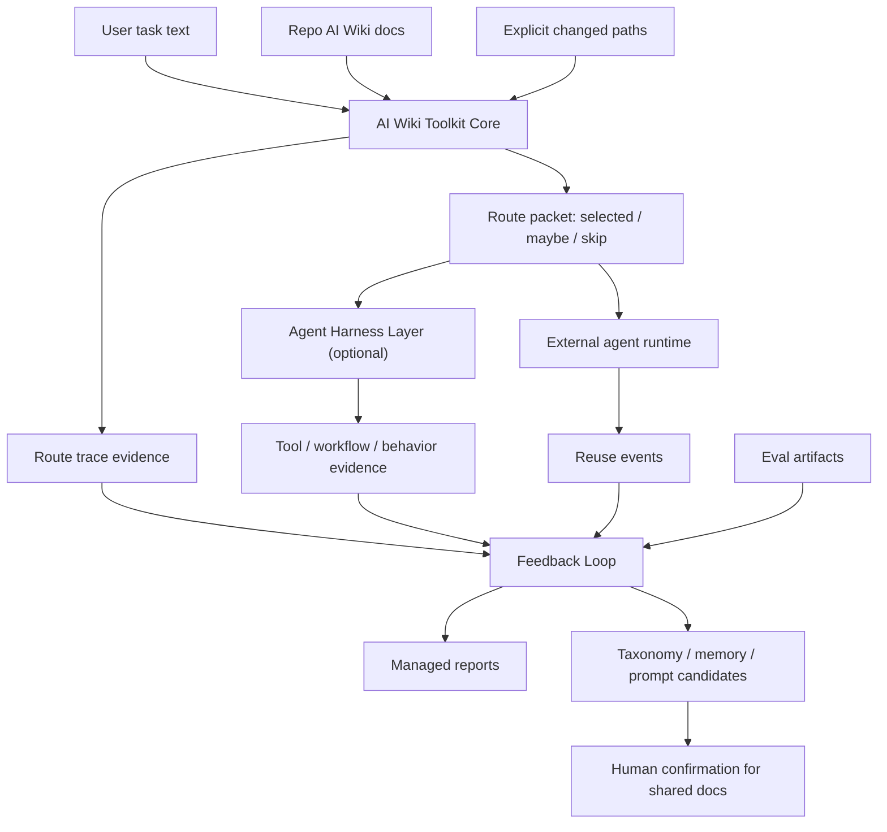

# AI Wiki Toolkit Layered Architecture

Date: 2026-06-08

## Summary

AI Wiki Toolkit should be organized as three layers:

```text
AI Wiki Toolkit Core
  repo memory routing + trace + retrieval eval

Agent Harness Layer
  workflow skills + tool risk policy + phase state + behavior tests

Feedback Loop
  route/eval/behavior evidence -> failure clusters -> taxonomy/router/prompt updates
```

The key product boundary is:

```text
AI Wiki Toolkit Core is context construction, not agent runtime control.
```

Core should help an agent find the right repo memory. It should not silently decide whether an
agent may edit files, push branches, create PRs, or execute a workflow. Those runtime behaviors
belong in a separate harness or adapter layer.

## Current Problem

The current implementation has useful research artifacts, but the architecture mixes three
different responsibilities inside the routing path:

```text
route.py
  - task interpretation
  - memory document selection
  - phase_plan shadow output
  - behavior_contract output
  - route trace fields
  - replay and activation signals through downstream reports
```

This creates a product ambiguity:

```text
Is aiwiki-toolkit route a memory router?
Or is it an agent controller?
```

The correct answer should be:

```text
aiwiki-toolkit route is a repo-memory context router.
Agent control is a separate layer.
```

## Target Layers

### 1. AI Wiki Toolkit Core

Primary question:

```text
What repo memory should the agent see for this task?
```

Core responsibilities:

- read task text and explicit changed paths
- build lightweight document catalog / index cards
- classify retrieval signals, not agent behavior
- select `must_load`, `selected`, `maybe_load`, and `skip`
- explain selection reasons
- record route traces
- evaluate retrieval quality

Core outputs:

```text
selected_doc_ids
maybe_load_doc_ids
must_load_doc_ids
skip_doc_ids
candidate_doc_ids
selection_reason_types
doc_slots
route_scores
packet_words
route_trace
```

Core metrics:

```text
failed@selected
failed@selected+maybe
failed@candidate20
retrieval_precision
coverage@K
missed_useful
context_cost
maybe_recovery
```

Core should not own:

```text
permissions
disallowed_actions
push policy
PR policy
tool approval policy
workflow execution
agent behavior tests
```

Suggested module boundary:

```text
src/ai_wiki_toolkit/route.py
src/ai_wiki_toolkit/route_traces.py
src/ai_wiki_toolkit/impact_analysis.py    # retrieval replay/report slice only
```

### 2. Agent Harness Layer

Primary question:

```text
How should an agent execute the task safely and reliably?
```

Harness responsibilities:

- represent phase state
- map user intent into workflow skills
- manage tool risk policy
- define approval boundaries
- track tool calls and execution artifacts
- run behavior tests
- support Codex / Claude Code / OpenCode adapters

Harness outputs:

```text
phase_state
tool_events
workflow_events
behavior_test_results
adapter_hints
agent_run_trace
```

Harness metrics:

```text
workflow_identified
workflow_steps_completed
tool_policy_compliance
no_edit_compliance
validation_performed
push_or_pr_policy_compliance
behavior_pass_rate
```

Suggested module boundary:

```text
src/ai_wiki_toolkit/agent_harness.py
src/ai_wiki_toolkit/agent_adapters/
src/ai_wiki_toolkit/route_behavior.py     # move or rename under harness
```

Behavior tests belong here, not in Core route activation.

### 3. Feedback Loop

Primary question:

```text
What should the system learn from route failures, behavior failures, and user corrections?
```

Feedback responsibilities:

- join route traces, reuse events, agent traces, behavior tests, and eval artifacts
- detect false positives, missed useful docs, unknown task language, and user corrections
- cluster repeated failures
- generate `TaxonomyCandidate`
- generate memory / prompt / workflow update candidates
- decide activation status separately per layer

Feedback outputs:

```text
taxonomy_evidence
taxonomy_candidates
failure_clusters
activation_reports
memory_candidates
prompt_update_candidates
workflow_candidates
```

Feedback metrics:

```text
cluster_coherence
shadow_replay_delta
behavior_test_delta
regression_count
activation_decision
```

Suggested module boundary:

```text
src/ai_wiki_toolkit/feedback.py
src/ai_wiki_toolkit/taxonomy_evidence.py
src/ai_wiki_toolkit/taxonomy_candidates.py
src/ai_wiki_toolkit/route_activation.py   # keep activation, but split route vs harness gates
```

## Write-Back Ownership

Write-back should be split by evidence type.

### route.py writes retrieval evidence

Allowed writes:

```text
ai-wiki/metrics/route-traces/<handle>.jsonl
```

Content:

```text
task
selected_doc_ids
maybe_load_doc_ids
candidate_doc_ids
selection_reason_types
scores
packet_words
```

Not allowed:

```text
taxonomy activation
shared memory edits
workflow edits
agent behavior conclusions
```

### agent_harness.py writes behavior evidence

Allowed writes:

```text
ai-wiki/metrics/agent-runs/<handle>.jsonl
ai-wiki/metrics/tool-events/<handle>.jsonl
ai-wiki/metrics/behavior-tests/<handle>.jsonl
```

Content:

```text
phase started/completed
tool called
tool risk level
validation result
push attempted or not
workflow step completed
behavior test pass/fail
```

Not allowed:

```text
shared memory edits
taxonomy activation without feedback gate
```

### feedback.py decides what should be learned

Allowed writes:

```text
ai-wiki/metrics/taxonomy-evidence/<handle>.jsonl
ai-wiki/_toolkit/reports/feedback/<handle>/latest.md
ai-wiki/_toolkit/reports/taxonomy-candidates/<handle>/latest.md
ai-wiki/people/<handle>/drafts/<new-memory>.md
```

Shared docs remain protected:

```text
ai-wiki/conventions/**
ai-wiki/problems/**
ai-wiki/workflows.md
ai-wiki/decisions.md
```

Those require promotion candidate plus human confirmation.

## Activation Gates

Activation must be layer-specific.

### Route Core Activation

Only use retrieval metrics:

```text
failed@selected non-increasing
failed@selected+maybe non-increasing
failed@candidate20 non-increasing
retrieval_precision non-regressing
coverage@K non-regressing
missed_useful non-increasing, or explicitly justified
context_cost not meaningfully higher
```

Do not use:

```text
agent no-edit compliance
validation behavior
push/PR behavior
tool call behavior
```

### Agent Harness Activation

Use behavior metrics:

```text
workflow identified
tool policy followed
phase transitions correct
validation performed when required
no forbidden push/PR
no forbidden file edits
```

Harness activation may depend on route packets, but route activation should not depend on harness
behavior.

### Feedback Activation

Use evidence gates:

```text
Gate 1: repeated evidence cluster
Gate 2: shadow replay or behavior test proves improvement
Gate 3: no meaningful regression
```

Until all gates pass, new taxonomy or workflow rules remain `proposed` or `shadow`, not active.

## Revised Route Packet Shape

Core route packet should emphasize retrieval:

```yaml
route:
  task_type: memory_governance
  domain_tags: [...]
  guardrail_tags: [...]
  eval_stage:
    primary: route_usefulness
    compatible_doc_slots: [...]

selected_docs:
  - doc_id: ...
    reason_type: bucket_primary
    doc_slots: [...]
    score: ...

maybe_load:
  - doc_id: ...
    reason: possible adjacent support

skip:
  - doc_id: ...
    reason: wrong stage / weak signal

diagnostics:
  candidate_doc_ids: [...]
  selection_reason_types: {...}
  packet_words: 1234
```

Adapter material should be clearly marked as optional:

```yaml
adapter_hints:
  status: shadow
  suggested_phase: plan
  suggested_agent_surface_mode: plan
  source: route_interpretation
  authority: non_binding
```

Avoid presenting this as a command to the agent.

## Code Reorganization Plan

### Phase 1: Rename and clarify surfaces

- keep current functionality
- rename behavior material in packet to `adapter_hints`
- mark `phase_plan` as shadow and non-binding
- update report language to separate retrieval and behavior metrics

### Phase 2: Split activation reports

- `route_activation.py` only evaluates retrieval metrics
- move behavior activation into `agent_harness.py` or a harness-specific report module
- combined reports can still exist, but must preserve separate verdicts

### Phase 3: Move behavior tests

- move `route_behavior.py` toward harness ownership
- rename tests to reflect harness behavior, not route precision
- keep route tests focused on selected/maybe/candidate20 correctness

### Phase 4: Introduce feedback module

- keep taxonomy evidence append-only
- keep TaxonomyCandidate induction in Feedback
- route core only records evidence; it does not activate taxonomy

### Phase 5: Documentation and public boundary

- public docs describe AI Wiki Toolkit Core as context construction
- agent harness is described as an optional next-layer product
- write-back policy is documented as append-only evidence first, shared-doc promotion later

## Architecture Diagram



## Practical Product Framing

The product should be described in layers:

```text
AI Wiki Toolkit Core:
  repo-native context construction and retrieval evaluation

Agent Harness:
  optional workflow and tool-use control for agents that support it

Feedback Loop:
  evidence-driven improvement system for memory, taxonomy, prompts, and workflows
```

This preserves the original AI Wiki Toolkit value while leaving a credible path toward an agent
framework.

## Immediate Decision

Keep the latest report-only retrieval metrics deployable:

```text
failed@selected
failed@selected+maybe
failed@candidate20
coverage@K
maybe_recovery
context_cost
candidate_doc_ids
```

Do not activate agent-control behavior from route core:

```text
phase_plan as binding control
behavior_contract as binding control
permissions enforcement
workflow execution
push/PR policy
```

Those belong in the optional Agent Harness Layer.
